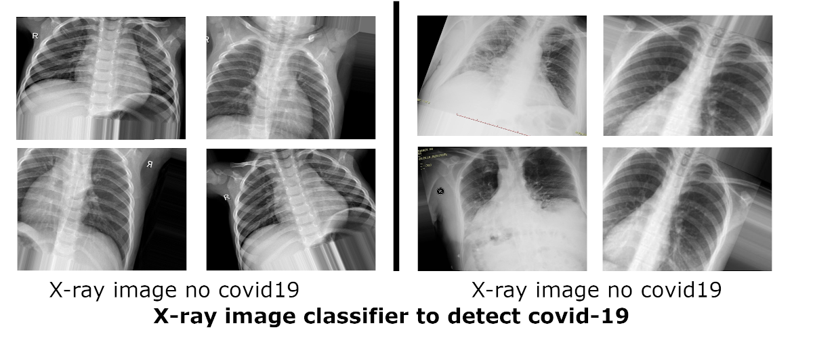

# VGG19 to diagnose COVID-19 in X-Rayimages


## VGG19 Architecture

<p align="center">
  
</p>
  So in simple language VGG is a deep CNN used to classify images. The layers in VGG19 model are as follows:

    Conv3x3 (64)
    Conv3x3 (64)
    MaxPool
    Conv3x3 (128)
    Conv3x3 (128)
    MaxPool
    Conv3x3 (256)
    Conv3x3 (256)
    Conv3x3 (256)
    Conv3x3 (256)
    MaxPool
    Conv3x3 (512)
    Conv3x3 (512)
    Conv3x3 (512)
    Conv3x3 (512)
    MaxPool
    Conv3x3 (512)
    Conv3x3 (512)
    Conv3x3 (512)
    Conv3x3 (512)
    MaxPool
    Fully Connected (4096)
    Fully Connected (4096)
    Fully Connected (1000)
    SoftMax

## Dataset [Link](https://towardsdatascience.com/covid-19-imaging-dataset-chest-xray-ct-for-annotation-collaboration-5f6e076f5f22)



## Getting Started

These instructions will get you a copy of the project up and running on your local machine for development and testing purposes. See deployment for notes on how to deploy the project on a live system.

### Prerequisites

What things you need to install the software and how to install them

```
pip install --upgrade tensorflow
pip install --upgrade numpy
```

## Installation

First clone the repository 

```
git clone https://github.com/madscientistCS/VGG19-to-diagnose-COVID-19-in-X-Ray-images.git
```
run train 
```
cd .\src\CNN\vgg19.py\
python .\vgg19.py
```
predict
run train 
```
python .\predict.py
```


## Contributing
Pull requests are welcome. For major changes, please open an issue first to discuss what you would like to change.

Please make sure to update tests as appropriate.

## License
[License MIT](https://choosealicense.com/licenses/mit/)
